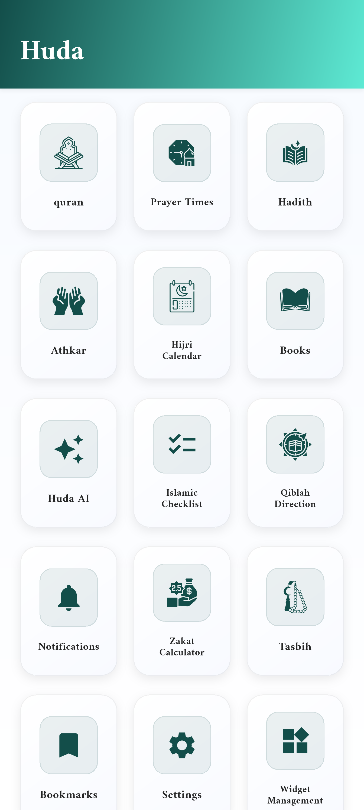
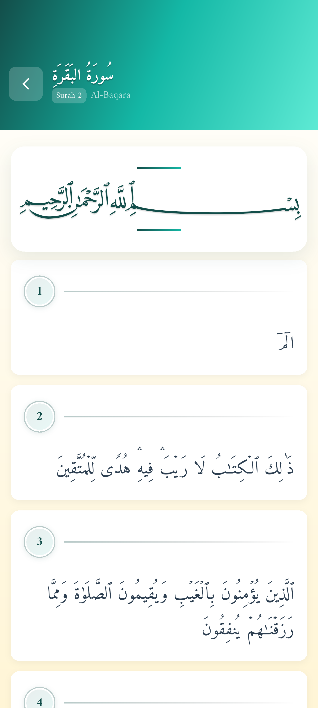
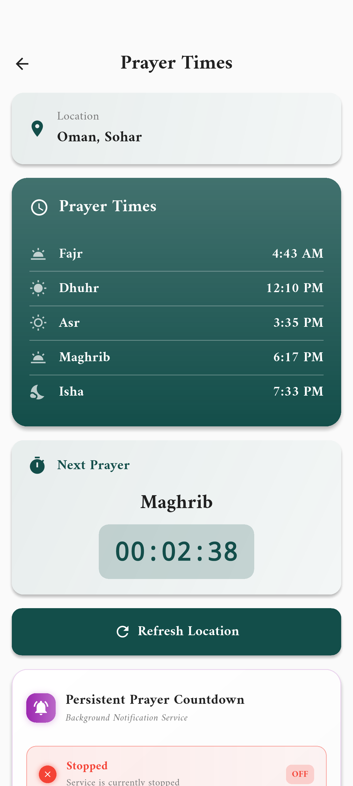
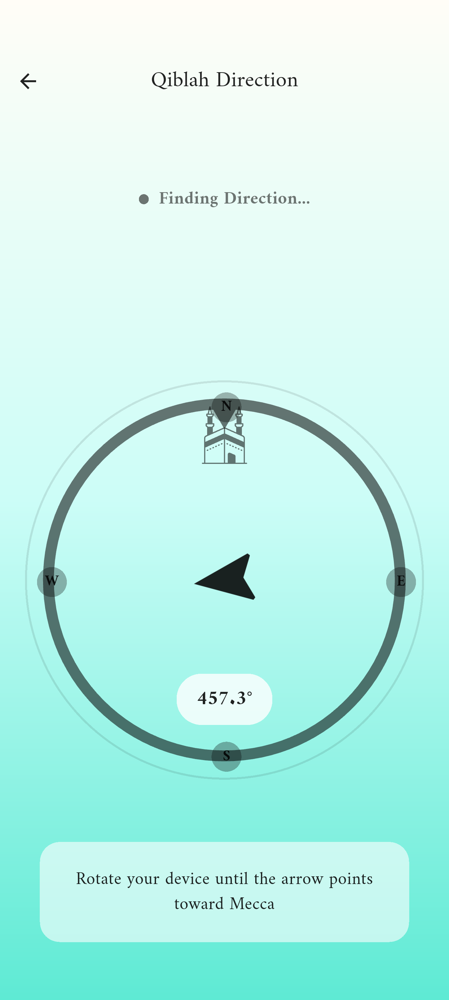
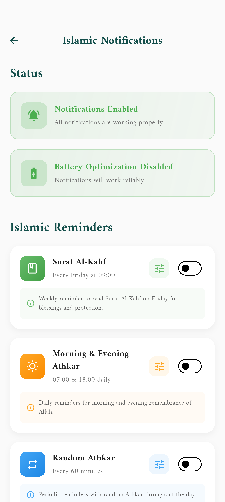
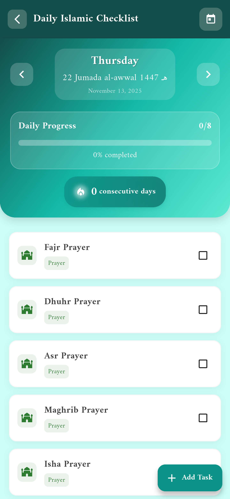

<div align="center">
  
  
# Huda - Islamic Companion App

[](https://github.com/abdulwahed-s/huda/releases/latest)
[](https://github.com/abdulwahed-s/huda/releases)
[]()

[](https://play.google.com/store/apps/details?id=com.aw.huda)
[](https://appgallery.huawei.com/app/C115050257?sharePrepath=ag&channelId=github&id=5522aff111f141d5a6acb26dca07ea6a&s=A18C3E4E69C7626366049CEE3F09F3E0246CB1DFBDB3D27FD30C12F48B5BB14F&detailType=0&v=&callType=AGDLINK&installType=0000&shareTo=qrcode)
[](https://github.com/abdulwahed-s/huda/releases/latest)

</div>


**Huda** is a comprehensive Flutter-based Islamic companion application designed to help Muslims practice their faith with ease and convenience. The app provides essential Islamic tools, resources, and features to support daily worship and spiritual growth.


## 🌟 Features

### 📖 Quran Reading & Study
- **Complete Quran**: Access to all 114 Surahs with beautiful Arabic text using authentic Uthmanic script
- **Advanced Audio Player**: Play Quranic recitations with multiple reciters and languages
- **Offline Support**: Download Surahs for offline reading and listening
- **Tafsir Integration**: Access multiple Tafsir (commentary) sources for deeper understanding
- **Translation Support**: Multiple language translations available
- **Smart Search**: Search Surahs by name, number, or content
- **Reading Position Tracking**: Automatically saves and resumes your reading position
- **Bookmarks**: Save and organize your favorite verses
- **Beautiful UI**: Elegant design with dark/light theme support

### 🕌 Prayer Times & Notifications
- **Accurate Prayer Times**: Location-based prayer time calculations using the Adhan library
- **Smart Notifications**: Automated prayer time notifications with background scheduling
- **Multiple Calculation Methods**: Support for different prayer time calculation methods
- **Location Services**: Automatic location detection with manual override options
- **Countdown Timer**: Real-time countdown to next prayer
- **Background Notifications**: Reliable prayer notifications even when app is closed

### 🧭 Qiblah Direction
- **Accurate Qiblah Compass**: Precise Qiblah direction using device sensors
- **Visual Indicators**: Beautiful compass interface with smooth animations
- **Vibration Feedback**: Haptic feedback when pointing towards Qiblah
- **Permission Handling**: Smart location and sensor permission management

### 📿 Digital Tasbih (Counter)
- **Interactive Counter**: Beautiful animated counter for dhikr and tasbeeh
- **Note Taking**: Add personal notes and reminders to your counting sessions
- **Vibration Support**: Optional haptic feedback for each count
- **Reset Functionality**: Easy reset with confirmation dialogs
- **Persistent Storage**: Automatically saves your count and notes

### 🤲 Athkar (Supplications)
- **Comprehensive Collection**: Extensive collection of daily Islamic supplications
- **Categorized Content**: Organized athkar for different times and occasions
- **Search Functionality**: Find specific athkar quickly
- **Beautiful Typography**: Elegant Arabic text with translations
- **Audio Support**: Listen to proper pronunciation

### ✅ Islamic Daily Checklist
- **Daily Worship Tracker**: Track your daily Islamic practices and prayers
- **Custom Items**: Add personalized checklist items
- **Progress Visualization**: Beautiful progress indicators and animations
- **Streak Tracking**: Monitor your consistency over time
- **Hijri Calendar Integration**: Organized by Islamic calendar dates
- **Celebration Effects**: Motivational animations for completed tasks

### 📅 Hijri Calendar
- **Islamic Calendar**: Full Hijri calendar with Gregorian date conversion
- **Event Management**: Add and track important Islamic dates and personal events
- **Color Coding**: Organize events with custom colors
- **Notification Support**: Set reminders for important Islamic dates
- **Monthly/Yearly Views**: Flexible calendar viewing options

### 🤖 Huda AI Assistant
- **Islamic Q&A**: AI-powered assistant for Islamic questions
- **Authentic Sources**: Responses based on Quran and authentic Hadith
- **Scholarly References**: Answers follow reliable Sunni scholarship
- **Chat Interface**: User-friendly conversation interface
- **Copy & Share**: Share AI responses easily

### 📚 Islamic Books & Hadith
- **Hadith Collections**: Access to authentic Hadith collections
- **Islamic Literature**: Curated collection of Islamic books and resources
- **PDF Viewer**: Built-in PDF reader for Islamic texts
- **Offline Access**: Download books for offline reading
- **Search Functionality**: Find specific hadith and content

### 🔖 Bookmarks & Reading History
- **Verse Bookmarking**: Save favorite Quranic verses with notes
- **Reading History**: Track your Quran reading progress
- **Quick Access**: Fast navigation to bookmarked content
- **Export Options**: Share bookmarked verses

### 🌐 Multilingual Support
- **Arabic**: Native Arabic support with proper RTL layout
- **English**: Full English translation and interface
- **Multiple Languages**: Support for various languages and localizations
- **Dynamic Language Switching**: Change language without app restart

### 🎨 Customization & Themes
- **Dark/Light Themes**: Beautiful themes optimized for day and night reading
- **Font Options**: Multiple Arabic fonts including Amiri and Uthmanic scripts
- **Responsive Design**: Optimized for different screen sizes
- **Accessibility**: Support for screen readers and accessibility features

### 📱 Home Screen Widgets
- **Prayer Time Widget**: Quick access to prayer times from home screen
- **Quick Actions**: Fast access to frequently used features
- **Widget Management**: Customize and configure home screen widgets

### ⚙️ Settings & Preferences
- **Prayer Calculation Settings**: Customize prayer time calculation methods
- **Notification Preferences**: Control notification timing and sounds
- **Language Settings**: Switch between supported languages
- **Theme Preferences**: Customize app appearance
- **Storage Management**: Manage downloaded content and cache

### 🔧 Technical Features
- **Offline Capability**: Core features work without internet connection
- **Background Processing**: Prayer notifications and reminders work in background
- **Firebase Integration**: Cloud storage for user preferences and sync
- **Performance Optimized**: Smooth animations and fast loading times
- **Error Handling**: Robust error handling and recovery mechanisms
- **Platform Support**: Available for Android, iOS, Windows, macOS, and Linux

## 📋 Installation Instructions

### Prerequisites
- **Flutter SDK**: Version 3.6.2 or higher
- **Dart SDK**: Version 3.6.2 or higher
- **Android Studio** or **VS Code** with Flutter extensions
- **Git** for version control

### Steps
1. **Clone the repository**:
   ```bash
   git clone https://github.com/abdulwahed-s/Huda.git
   cd Huda
   ```

2. **Install dependencies**:
   ```bash
   flutter pub get
   ```

3. **Configure Firebase** (Optional for full functionality):
   - Create a new Firebase project
   - Add Android/iOS apps to your Firebase project
   - Download and place configuration files:
     - `google-services.json` in `android/app/`
     - `GoogleService-Info.plist` in `ios/Runner/`

4. **Run the application**:
   ```bash
   flutter run
   ```

### Build for Production
```bash
# Android APK
flutter build apk --release

# Android App Bundle
flutter build appbundle --release

# iOS
flutter build ios --release

# Windows
flutter build windows --release

# macOS
flutter build macos --release

# Linux
flutter build linux --release
```

## 🚀 Usage Instructions

### First Launch
1. **Language Selection**: Choose your preferred language on first launch
2. **Location Permission**: Grant location access for accurate prayer times
3. **Notification Permission**: Allow notifications for prayer reminders
4. **Setup Complete**: Start exploring the app's features

### Daily Usage
1. **Check Prayer Times**: View today's prayer schedule on the home screen
2. **Read Quran**: Access the Quran reader with your saved reading position
3. **Track Progress**: Use the Islamic checklist to track daily worship
4. **Find Qiblah**: Use the compass feature when traveling
5. **Count Dhikr**: Use the digital Tasbih for remembrance

### Customization
1. **Settings Menu**: Access app settings from the home screen
2. **Theme Selection**: Switch between light and dark themes
3. **Prayer Calculation**: Adjust prayer time calculation methods
4. **Language Change**: Switch languages dynamically
5. **Notification Setup**: Customize prayer notification preferences

## 📸 Screenshots


| Home Screen | Quran Reader | Prayer Times |
|-------------|-------------|-------------|
|  |  |  |
| **Qiblah Compass** | **Islamic Reminder** | **Islamic Checklist** |
|  |  |  |

## 📄 License

This project is licensed under the **MIT License** - see the [LICENSE](LICENSE) file for details.

## 🤝 Contributing Guidelines

We welcome contributions from the community! Here's how you can help improve Huda:

### How to Contribute
1. **Fork the Repository**: Create your own fork of the project
2. **Create a Branch**: Make a new branch for your feature (`git checkout -b feature/AmazingFeature`)
3. **Make Changes**: Implement your improvements with clean, documented code
4. **Test Thoroughly**: Ensure your changes work across different devices and scenarios
5. **Commit Changes**: Use clear, descriptive commit messages (`git commit -m 'Add amazing feature'`)
6. **Push to Branch**: Push your changes to your fork (`git push origin feature/AmazingFeature`)
7. **Open Pull Request**: Submit a pull request with a detailed description

### Contribution Areas
- **Bug Fixes**: Help identify and fix issues
- **Feature Development**: Add new Islamic tools and features
- **UI/UX Improvements**: Enhance the user interface and experience
- **Localization**: Add support for more languages
- **Documentation**: Improve code documentation and user guides
- **Testing**: Write and improve test coverage
- **Performance**: Optimize app performance and responsiveness

### Code Standards
- Follow **Flutter/Dart** coding conventions
- Write **clean, readable code** with proper documentation
- Include **unit tests** for new features
- Ensure **responsive design** across different screen sizes
- Follow **Islamic guidelines** for content and features
- Maintain **cross-platform compatibility**

### Feature Requests
- Open an **issue** to discuss new feature ideas
- Provide **detailed descriptions** of proposed features
- Consider **Islamic authenticity** and scholarly approval
- Ensure features align with the app's **spiritual purpose**

## 👨‍💻 Author & Contact Information


### Contact Information
- **Email**: abdulwahedaldaghir0@gmail.com
- **GitHub**: [@abdulwahed-s](https://github.com/abdulwahed-s)
- **Project Repository**: [https://github.com/abdulwahed-s/Huda](https://github.com/abdulwahed-s/Huda)

### Support & Feedback
- **Bug Reports**: Use GitHub Issues for bug reports
- **Feature Requests**: Submit enhancement ideas via GitHub Issues
- **General Questions**: Contact us via email
- **Islamic Content**: For Islamic content queries, consult qualified scholars


---

### 🤲 Islamic Disclaimer
*Huda app is designed to assist Muslims in their daily worship and learning. While we strive for accuracy in all Islamic content, users are encouraged to consult qualified Islamic scholars for religious guidance. The app's AI assistant provides responses based on established Islamic sources, but should not replace consultation with knowledgeable religious authorities for important religious matters.*

### 🌟 Acknowledgments
- **Quran Text**: Sourced from authentic Uthmanic script
- **Prayer Time Calculations**: Based on established Islamic astronomical calculations
- **Hadith Collections**: From authentic collections (Bukhari, Muslim, etc.)
- **Islamic Scholars**: Thanks to the scholars who reviewed our content for authenticity
- **Community**: Grateful to the Muslim developer community for feedback and contributions
- **Open Source Libraries**: Thanks to all the amazing open-source Flutter packages that made this app possible

---

**May Allah (SWT) accept this work and make it beneficial for the Ummah. Ameen.**

*"And whoever does righteous deeds, whether male or female, while being a believer - those will enter Paradise and will not be wronged, [even as much as] the speck on a date seed."* - **Quran 4:124**
