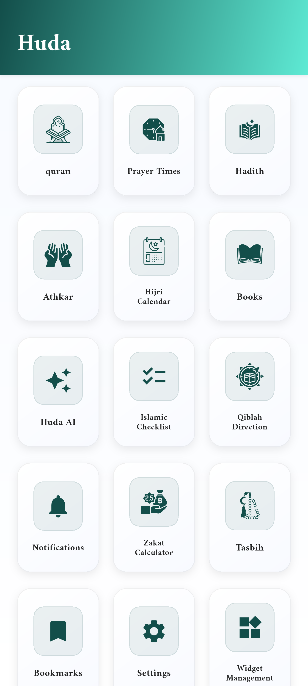
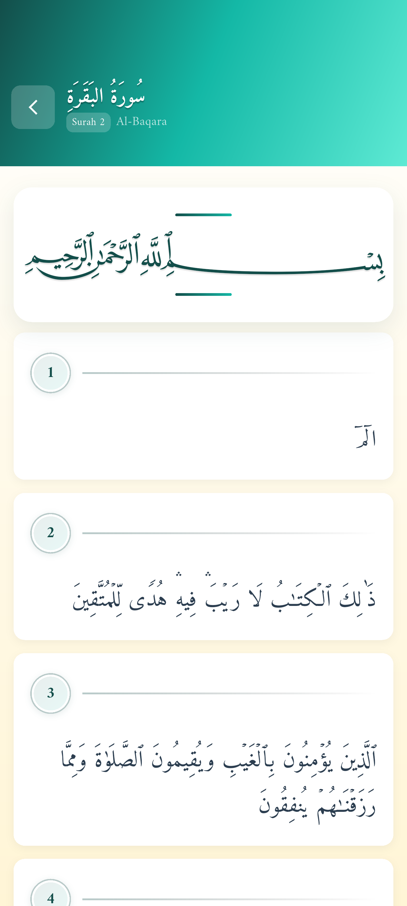
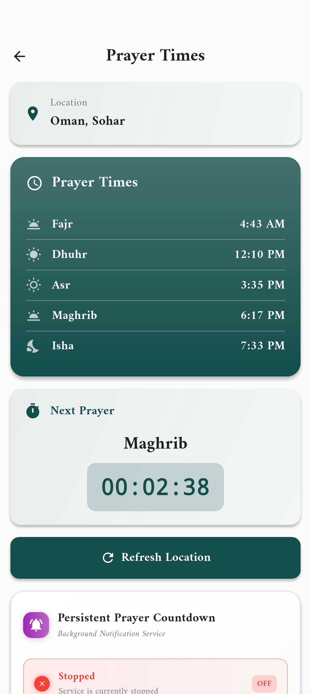
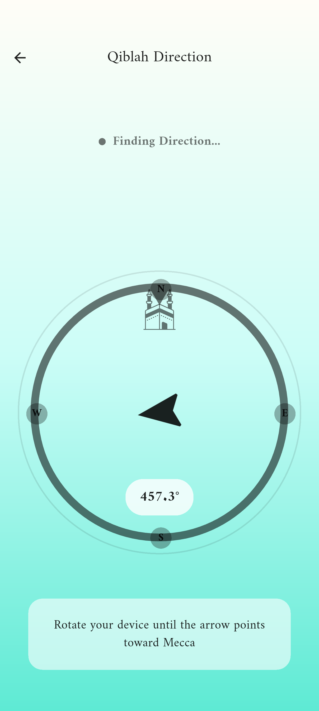
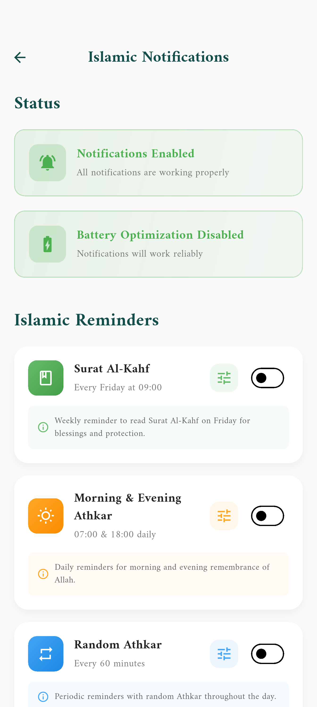
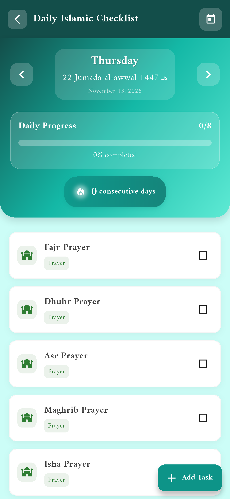

<div align="center">
  
  
# Huda - Islamic Companion App

[](https://github.com/abdulwahed-s/huda/releases/latest)
[](https://github.com/abdulwahed-s/huda/releases)
[]()

[](https://play.google.com/store/apps/details?id=com.aw.huda)
[](https://appgallery.huawei.com/app/C115050257?sharePrepath=ag&channelId=github&id=5522aff111f141d5a6acb26dca07ea6a&s=A18C3E4E69C7626366049CEE3F09F3E0246CB1DFBDB3D27FD30C12F48B5BB14F&detailType=0&v=&callType=AGDLINK&installType=0000&shareTo=qrcode)
[](https://github.com/abdulwahed-s/huda/releases/latest)
[](https://apps.microsoft.com/detail/9P68H8M1G92B)
[](https://apps.apple.com/us/app/huda-islamic-companion-app/id6757343816)

</div>

---

**Huda** is a comprehensive Flutter-based Islamic companion application designed to help Muslims practice their faith with ease and convenience. The app provides essential Islamic tools, resources, and features to support daily worship and spiritual growth.


## 📑 Table of Contents

* [Screenshots](#-screenshots)
* [Quick Start](#-quick-start)
* [Key Features](#-key-features)
* [Contributing](#-contributing)
* [License & Contact](#-license--contact)

---

## 📸 Screenshots

| Home                                              | Quran Reader                                        | Prayer Times                                        |
| ------------------------------------------------- | --------------------------------------------------- | --------------------------------------------------- |
|  |  |  |

| Qiblah Compass                                          | Islamic Reminder                                    | Daily Checklist                                       |
| ------------------------------------------------------- | --------------------------------------------------- | ----------------------------------------------------- |
|  |  |  |

---

## 🚀 Quick Start

### Prerequisites

* **Flutter SDK:** `3.6.2` or higher
* **Dart SDK:** `3.6.2` or higher

### Installation

#### 1. Clone the repository

```bash
git clone https://github.com/abdulwahed-s/Huda.git
cd Huda
```

#### 2. Install dependencies

```bash
flutter pub get
```

#### 3. Configure Firebase *(Optional but Recommended)*

1. Create a Firebase project and register your applications.
2. Place `google-services.json` inside:

```text
android/app/
```

3. Place `GoogleService-Info.plist` inside:

```text
ios/Runner/
```

4. Configure your API keys in:

```text
lib/core/keys/hadith_key.dart
```

For more information, see:
https://github.com/abdulwahed-s/Huda/issues/1

#### 4. Run the application

```bash
flutter run
```

---

## 🌟 Key Features

### 📖 Quran Reading & Study

* Complete Quran with authentic Uthmanic script
* Multiple translations and Tafsir support
* Audio recitations with offline playback
* Smart reading position tracking

### 🕌 Prayer Times & Adhan

* Accurate location-based prayer times
* Adhan notifications and countdown timers
* Multiple calculation methods

### 🧭 Qiblah Compass

* Accurate Qiblah direction
* Smooth animations with haptic feedback

### 📿 Digital Tasbih

* Persistent Dhikr counter
* Notes and tracking support

### 🤲 Athkar & Duas

* Categorized daily supplications
* Audio pronunciation support

### ✅ Islamic Daily Checklist

* Track prayers and habits
* Hijri calendar integration
* Daily streak tracking

### 🤖 Huda AI Assistant

* AI-powered Islamic Q&A assistant
* Responses based on authentic Sunni sources, Quran, and Hadith

### 📚 Hadith & Islamic Library

* Curated Islamic books and Hadith collections
* Built-in offline PDF reader

### 📱 Home Screen Widgets

* Quick access to prayer times and core features

### 🌍 Multilingual Support & Themes

* RTL Arabic support
* Dynamic language switching
* Dark and Light themes

---

## 🤝 Contributing

Contributions are always welcome and greatly appreciated.

Whether you're fixing bugs, improving performance, adding features, or translating content, your support helps make Huda better for the Ummah.

### How to Contribute

1. Fork the repository
2. Create a new branch

```bash
git checkout -b feature/amazing-feature
```

3. Commit your changes

```bash
git commit -m "Add amazing feature"
```

4. Push to your branch

```bash
git push origin feature/amazing-feature
```

5. Open a Pull Request

> Please ensure all contributions align with authentic Islamic principles and the purpose of the application.

---

## 📄 License & Contact

This project is licensed under the **MIT License**.
See the [LICENSE](LICENSE) file for more information.

### 🐛 Bug Reports & Feature Requests

Please use [GitHub Issues](https://github.com/abdulwahed-s/Huda/issues) to report bugs, request features, or share suggestions.

---

## 🤲 Islamic Disclaimer

> Huda is designed to assist Muslims in worship, learning, and daily practice.
>
> While we strive to provide authentic and accurate Islamic content, users are encouraged to consult qualified scholars for religious guidance and important matters.
>
> The AI assistant provides responses based on established Islamic sources and should not replace knowledgeable scholars or trusted religious authorities.

---

<div align="center">

### May Allah ﷻ accept this work and make it beneficial for the Ummah. Ameen.

> *“And whoever does righteous deeds, whether male or female, while being a believer — those will enter Paradise and will not be wronged, even as much as the speck on a date seed.”*
> **— Quran 4:124**

</div>
